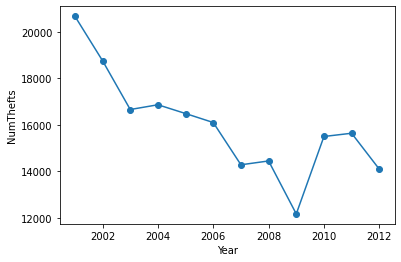
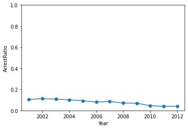
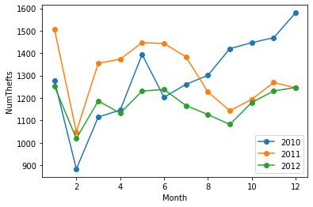

#  Motor vehicle thief Analysis - Introduction to Pandas

# Description

-   A small homework in Data Science Programming (University of Science).
-   Learn how to use Pandas.
-   Ask useful questions to obtain data insight.

# Table of contents

0. Collect data
1. Explore the data
2. Clean the data
3. Get data insight through questions
    1. Data preprocessing
    2. How does the number of crimes change from year to year?
    3. Given the cases that happen each year, what is the percentage of the perpetrators caught by the time the data is collected?
    4. In each year, which "Beat" has the most crimes and which "Beat" has the fewest?
    5. In the last 3 years, what 5 types of locations (off-streets, parking spaces, ...) have the most crime?
    6. In each of the last 3 years, how did the number of crimes change month-on-month?

# Usage

Online:

-   Go to this [Colab](https://colab.research.google.com/drive/1gVrY6ERHjdhzyXHfjF57jWMxHl6Dfqpr#scrollTo=XjI43Pdqc1CI) cause everything has been setup.
-   Or download notebook file above (`ipynb`), upload to your drive and you are good to go.

Local:

-   `Git clone`
-   `Env: linux`, but is you insist on using Windows, skip all the false cells, the rest should work fine.

# Screenshots

## Q. How does the number of crimes change from year to year?

## Q. Given the cases that happen each year, what is the percentage of the perpetrators caught by the time the data is collected?

## Q. In each of the last 3 years, how did the number of crimes change month-on-month?

